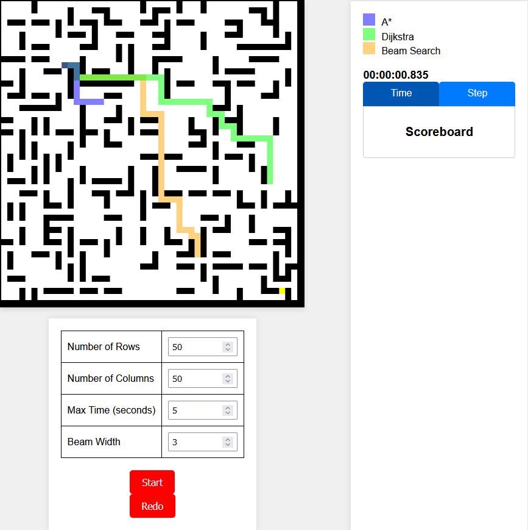
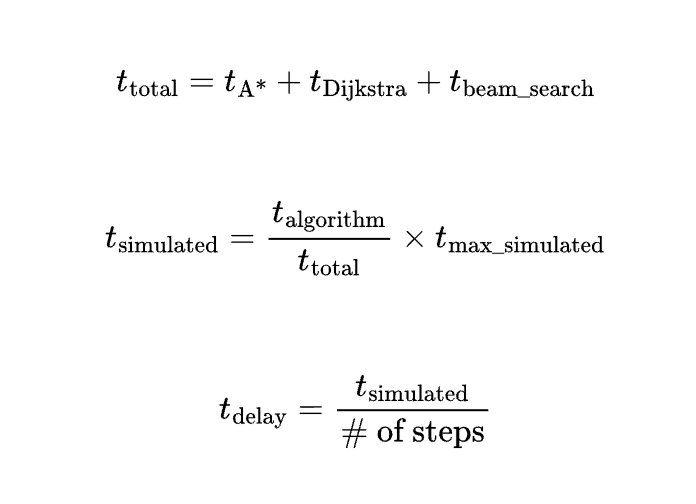
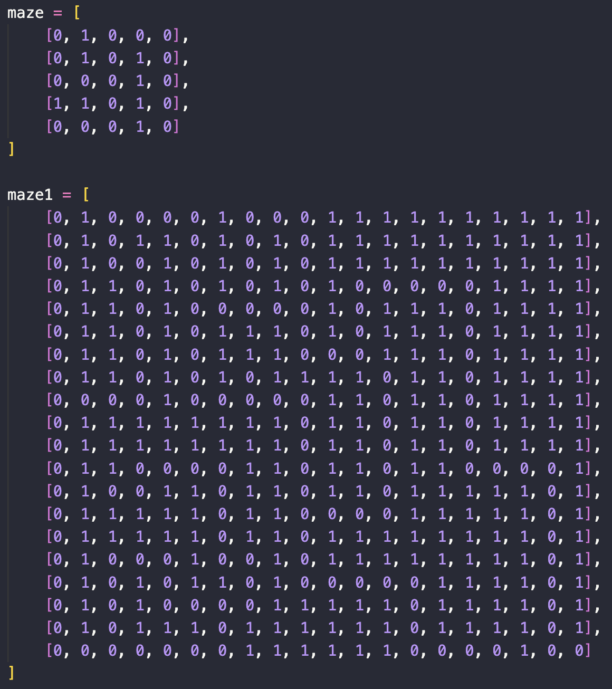
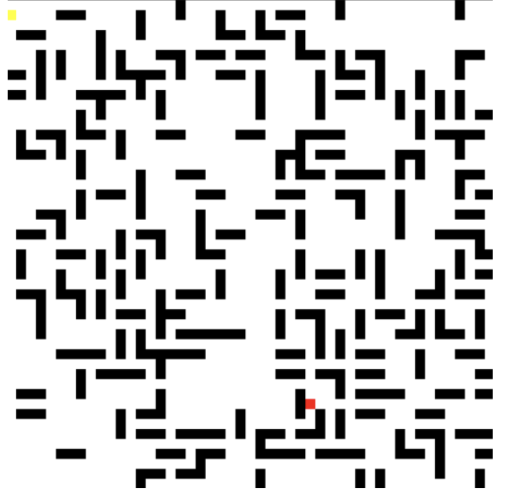
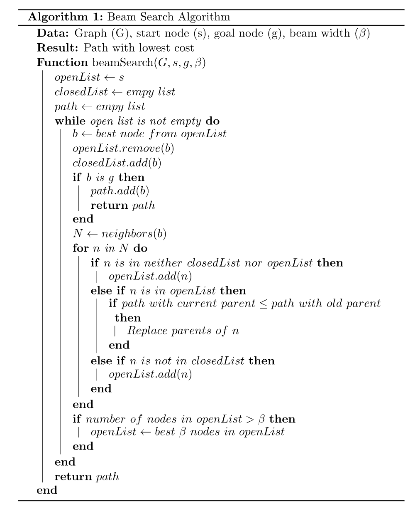
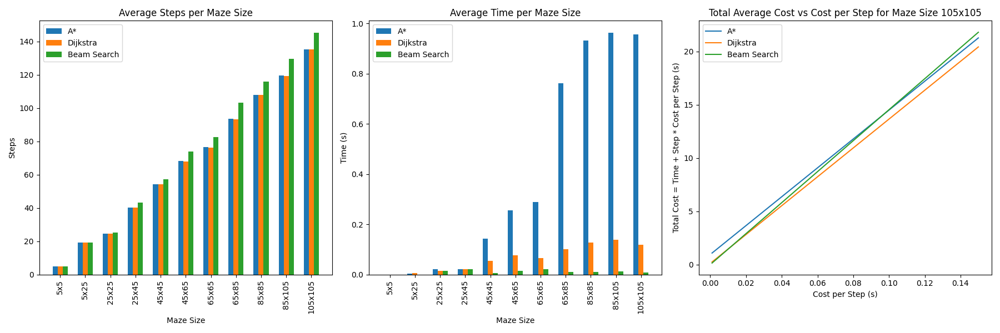

# Maze Solver AI

Project Completed for ECS 170  by:
Seungeui Song, Hai Nguyen, Justin Chiu, Katie Sharp, Harinderjit Malhi, Maia Burton.

## 1 Introduction
In the rapidly evolving field of artificial intelligence (AI), its ability to navigate complex environments is a critical skill in applications such as autonomous vehicles and robotics. This
project sought to advance the understanding and abilities of AI in solving complex mazes
through the development of different algorithms. Our group implemented an interactive web
application to showcase the AI’s problem solving skills and visualize the different effectiveness of informed and uninformed methods.

The primary objective in our project was to implement and refine multiple AI algorithms—
primarily A*, Dijkstra’s, and beam search—to efficiently navigate and solve mazes. Our
exploration extended beyond compare and contrast of different algorithms but also different
levels of maze difficulty including different sizes and loops. The exploration began with understanding the capabilities and limitations of different graph-based search algorithms, each
offering unique strategies to solve mazes. This realization guided our selection process, focusing on algorithms known for their efficiency and adaptability in finding the shortest path.
We focused on how both informed and less-informed algorithms perform in environments
where path costs are uniform, which influenced our algorithm choices.

Our project aimed to compare these algorithms’ performances to understand their nuances
and identify which algorithm best fits certain maze characteristics to balance computational
efficiency and solution accuracy.

## 2 Methodology

### 2.1 Web App
The app allows users to randomly generate a maze with configurable settings such as maze
width, maze height, and max simulation time. Additionally, users can adjust the beam width
specifically for the beam search algorithm. The app also includes a redo button, enabling
users to reuse the same maze while modifying the max time to adjust the simulation speed
or changing the beam width to observe its effects on the beam search algorithm. To draw
the solutions for all three mazes concurrently, our team used the non-blocking and parallel
execution properties of async. The scoreboard has tabs the user can press to view the time
to render a solution and the number of steps to reach the goal state.

#### 2.1.1 Server
All buttons within the web app interact with a local Flask server, which hosts all the maze
generation and solving algorithms. The server provides data to render both the maze and
the solutions for each algorithm. The maze generator endpoint accepts maze width and
height data and responds with the following maze data:
- A 2-D array representing the maze layout.
-  Two tuples representing the start and goal state within the maze.
Each algorithm endpoint accepts maze data and responds with the following solution data:
- An array of tuples representing the path, with each tuple representing position on the
maze from start to goal state.
- A numeric value indicating the execution time to get a solution.

#### 2.1.2 Rendering
HTML Canvas is used to render all visual elements like start and goal state, walls, empty
space, and lines that represent the solution for each algorithm. To draw a solution, the front
end iterates through the solution provided by an algorithm’s endpoint and a timer delay
that gets calculated using the algorithm’s execution time.

This timer delay allows each solution to be rendered proportionally based on how long it took
to generate a solution, which allows users to visually understand the time cost for producing
solutions with fewer steps.

### 2.2 Maze Generation
Our mazes were represented as 2-dimensional
arrays where 0’s represented a path and 1’s
were walls. This was effective when it came
to visualizing the algorithm traversal. After
each move to a new node, the algorithm could
mark it’s previous position with an ‘X‘ and
print out the new array; however, creating a
sufficiently sized maze by hand was difficult
and took a lot of time. A 5x5 maze was much
to easy, yet was still difficult to read and ensure it had a solution. The average difficultly
maze was about 20x20 maze, took a lot of
time and was difficult to do by hand.

In order to test our algorithms, we decided to make a random maze generator, with the goal
of being able to make relatively fair tests for the maze solving AIs, as well as to generate
multiple large mazes to really test the computational efficiency of the algorithms. The algorithm for maze generation must make solvable, and non-trivial mazes, with many possible
solutions. In order to create this, we first tried making an algorithm that starts at some
random point, and moves randomly in an adjacent direction, repeating this step until a cycle
is made or a set number of movements have been done. The result of this basic method were
simple, wide, mazes which are visibly easy to solve. Afterwards we looked into more complicated maze generation algorithms, and of the many available, such as Wilson’s, Kruskals,
etc. We decided to continue with an application of Prim’s algorithm, as it as one of the least
computationally expensive, and didn’t require a lot of math knowledge which we didn’t have
(such as random walks for Wilson’s).

The way our modified version of Prim’s
works:

1. Define an empty maze full of “walls”
2. Choose a starting point and “free” it
3. Find all existing points which are 2 consecutive movements from that “freed”
point.
4. Place those points on a list.
5. While that list is not empty, choose one
at random to pop, and free that popped
point, ad repeat steps 3 and 4 to this
point.
6. Free the wall between that freed point
and the point before it.
7. Repeat steps 5 and 6 in the while loop
until the list is empty.
8. Set the last visited point as the maze
solution

This method ensures that a solution exists, but “walls” also must exist, as there are plenty
of “blind spots” in step 3 which leave plenty of walls.

 ### 2.3 Maze Solving

 #### 2.3.1 Djikstra's Algorithm
 While Dijkstra’s is not technically uninformed because it considers the weights of the edges
(even if they are the same) to determine the shortest path, it is sometimes considered uninformed as it doesn’t use an additional heuristic to estimate the distances to the goal, unlike
A*. This algorithm always completes and is comprehensive.

Dijkstra’s algorithm is a classic method for finding the shortest paths between nodes in a
graph, which can be applied to solving mazes effectively. At its core, the algorithm treats
the problem as a graph traversal task where each decision point in the maze corresponds to
a node and each path connecting the nodes corresponds to an edge.

The algorithm starts a the node designated as the source (usually the maze’s entrance, however our maze generator selects start and end points as randomly as the layout of the maze)
and explores all possible routes through the maze by branching out to adjacent nodes. This
is achieved by maintaining a priority queue that keeps track of nodes based on their shortest
path distance from the source node.

##### How Djikstra's Works
Initially, the source node is assigned a distance of zero, while all other nodes are assigned
infinity. The algorithm then runs iteratively, extracting the node with the smallest distance
from the queue and updating the distances to its adjacent nodes. This update ensures that
if a shorter path to a node is found, the shorter path replaces the longer one.

Dijkstra’s continues to explore and update paths until it either finds the target node (the
exit/end node). The result is a path from the start to end locations with the smallest cumulative distance/cost.

#### 2.3.2 A* Algorithm
To enhance efficiency, we integrated A*, an algorithm that builds on the principles of Dijkstra’s but incorporates a heuristic to estimate the distance to the goal. This heuristic is
designed to prioritize paths that seem closer to the goal, potentially reducing the computational overhead by limiting the exploration of less promising paths.

##### Implementation and Operation
The A* algorithm begins at the starting point of the maze, examining all possible movements
— up, down, left, and right. It checks each potential direction to ensure it does not lead into
a wall to confirm that the move is viable. For each valid direction, the algorithm calculates
the f-scores of the resultant nodes using the Manhattan distance heuristic. The f-score is a
sum of the distance from the start node to the current node, and a heuristic estimate for
the distance from the current node to the end point of the maze. This distance measure effectively aids in estimating the shortest path from the current node to the goal.

We implemented a min-heap to manage the nodes based on their f-score which ensures that
the node with the lowest f-score is selected for processing next, facilitating an efficient search
towards the goal.

Upon processing, the node is transferred from the heap to a closed list, which keeps track
of all evaluated nodes. This node’s parent is then set as the new current node and the
algorithm is recalled and processes each node in this manner, continuing until it identifies
the end position of the maze.

##### Path Reconstruction
Once the end node is located, the path reconstruction begins. A function called “return
path” sequentially traces back from the end node to the start by navigating through each
node’s parent. This builds a path list that initially contains the end node and subsequently
includes every ancestor node up to the starting node.

To present the solution in a logical manner — from start to finish — the path list is reversed.
This final list represents the solved path for the maze and is what is used in the front-end
implementation of our project.

#### Beam Search Algorithm
Beam Search, on the other hand, introduces a different dimension to heuristic search by
imposing a limit on the breadth of the search—specifically, the number of nodes considered
at each level of the search (also known as beam width). This limitation is strategically
advantageous in large mazes or under constrained resource scenarios where an exhaustive
search is impractical. Since we are keeping the search within the beam width, the algorithm
is both runtime and memory efficient, but it is not guaranteed to give you the optimal result,
especially for searches with narrower beam widths.

It should be noted that this is an informed search algorithm that uses ’G’ and ’H’ costs.
’G’ represents the cumulative cost from the start node to the current node, while ’H’ is the
estimate cost from the current node to the goal node (in our case Manhattan Distance).

##### Implementation
We first initialize the algorithm by putting the start node in the open list and leaving the
closed list empty. Next, we expand the node in the open list by examining its neighbors
(adjacent nodes) only considering nodes that aren’t walls. The expanded node is now in the
closed list and for all valid neighbors we will update their G costs and set the expanded node
as their parent.

The neighbors are all added to the open list. Using Manhattan Distance, we will calculate
the H cost of each of the neighbors to combine it with their G costs. This will result in the F score. Using this combined cost score as our metric, we will keep only the nodes with the
lowest cost as determined by the beam width.

We repeat this process until the goal node is reached by which we will backtrack using the
nodes’ parents to display the path to the solution.

##### Sources Used:
Note that for the beam search implementation, I modeled my algorithm to that of the
pseudo-code found at: https://www.baeldung.com/cs/beam-search

## 3 Results and Discussion

### 3.1 Evaluating the Algorithms
To evaluate the performance of the algorithms, we developed some metrics for measurement.
Initially, we decided to measure the average time and average number of steps required to
solve an algorithm for a maze of a given size. However, as we tested increasingly larger mazes
and adjusted the beam width from time to time, we discovered a trade-off—particularly for
beam search—between the quality of the solution (number of steps required to solve a maze)
and the quantity (time required to solve a maze). Consequently, we introduced a third
metric: average cost. This metric aims to balance quality and quantity to provide a more
objective evaluation. We simulated 100 mazes per size, tested each algorithm, and calculated
the average steps and execution time, using a beam width of 3 for the beam search. Below are the results of our tests:

### 3.2 Result of Evaluation
In our investigation of maze-solving algorithms—A*, Dijkstra’s, and Beam Search—across
mazes of varying complexities, we initially hypothesized progressive improvements in efficiency and solution quality, from Dijkstra’s less-informed approach to the more informed
heuristic methods of A* and the strategically limited Beam Search. We expected that the
increasing incorporation of heuristics and optimization techniques would yield notable enhancements in both speed and accuracy.

Our results, however, painted a more nuanced picture, particularly as maze sizes increased
beyond 45x45. While all algorithms demonstrated comparable performance in smaller mazes,
their inherent characteristics became distinctly pronounced in larger mazes. Contrary to expectations, Dijkstra’s algorithm emerged as the most efficient in these complex scenarios.
Despite its computationally intensive comprehensive search, it benefited from the uniform
path costs across the mazes, making it the fastest among the three. This was an unexpected outcome, as theoretical understanding suggested that Dijkstra’s methodical exploration would be less suited to large-scale applications.

A*, anticipated to significantly outperform the others due to its heuristic-driven path selection, did not show a clear advantage in larger mazes. This suggests that the heuristic
used—designed to estimate distances to the goal—was not sufficiently discriminative under
conditions of uniformly weighted paths, resulting in performance akin to Dijkstra’s.

Beam Search showed dominance in terms of speed when the beam width was restricted to
less than 10, aligning with our initial expectations of the algorithm being potentially more
efficient under constrained settings. However, this came at a significant trade-off in increased
path lengths, indicating that while Beam Search could navigate through mazes quickly, it
often did so at the expense of finding the shortest or most optimal paths.

These observations challenge the conventional hierarchy of algorithm performance that is
based on the level of information utilized, from uninformed to highly heuristic. They under8
score the complexity of algorithm selection, emphasizing that theoretical advantages must
be weighed against practical outcomes in real-world scenarios. The uniformity of path costs,
a constant in our maze designs, played a pivotal role, particularly benefiting Dijkstra’s algorithm in larger mazes.

This nuanced understanding highlights the critical need for a contextual approach to algorithm selection in AI applications, where specific characteristics of the problem domain, such
as uniform path costs in a maze, can significantly influence performance. Moving forward,
these insights could guide more informed choices in the application of maze-solving algorithms and beyond.

## 4 Conclusion
This project has enhanced our understanding of AI’s capability to solve complex mazes using
different algorithms. Our findings suggest that while no single algorithm excels in all scenarios, each has its niche. A* offers a strong compromise between speed and accuracy, making
it ideal for most practical applications. Beam Search could be favored in resource-limited
settings where speed is crucial, and Dijkstra’s algorithm is optimal when the shortest path
is non-negotiable. Future work could explore hybrid approaches that dynamically adjust the
algorithm based on real-time analysis of the maze’s complexity or integrate machine learning
techniques to improve heuristic evaluation in A*.

## 5. Contribution

| Name             | Contribution                                                                                                                                                       |
|------------------|--------------------------------------------------------------------------------------------------------------------------------------------------------------------|
| Seungeui Song    | Worked on A*, checked Katie's code for each step of the process.  |
| Hai Nguyen       | Set up the initial project with the front end and back end communication. Modified everyone’s code to fit the expected data format, output execution times, identified issues with beam widths. Implemented rendering of solutions, stylized the UI, and added scoreboards.  |
| Justin Chiu      | Primarily worked on researching and implementing random maze generation. Worked with Hai to make testing criteria and code for evaluating algorithm performance. Assisted with front-end functions.  |
| Katie Sharp      | Aided in implementing the A* algorithm using a min-heap for sorting nodes by f-cost. Used Manhattan distance as a heuristic. Created a function to return the final path after execution.  |
| Harinderjit Malhi| Implemented the beam search algorithm using open and closed lists to track visited and frontier nodes. Used G and F costs for determining which nodes to keep.  |
| Maia Burton      | Implemented Dijkstra’s algorithm, optimized performance with a priority queue. Drafted project check-in and final reports.  |

# Running the Project Setps

## Setting up Flask Server
1. Create venv in backend using `python -m venv .\venv`
2. Change directory to venv/Scripts using `cd .\venv\Scripts`
3. Activate the venv using `.\activate`
4. Change directory to backend using `cd ..\..`
5. Install dependencies using `pip install -r requirements.txt`

## Starting Flask Server
1. Change directory to venv/Scripts using `cd .\venv\Scripts`
2. Activate the venv using `.\activate`
3. Change directory to backend using `cd ..\..`
4. Start Flask server using `python run.py`